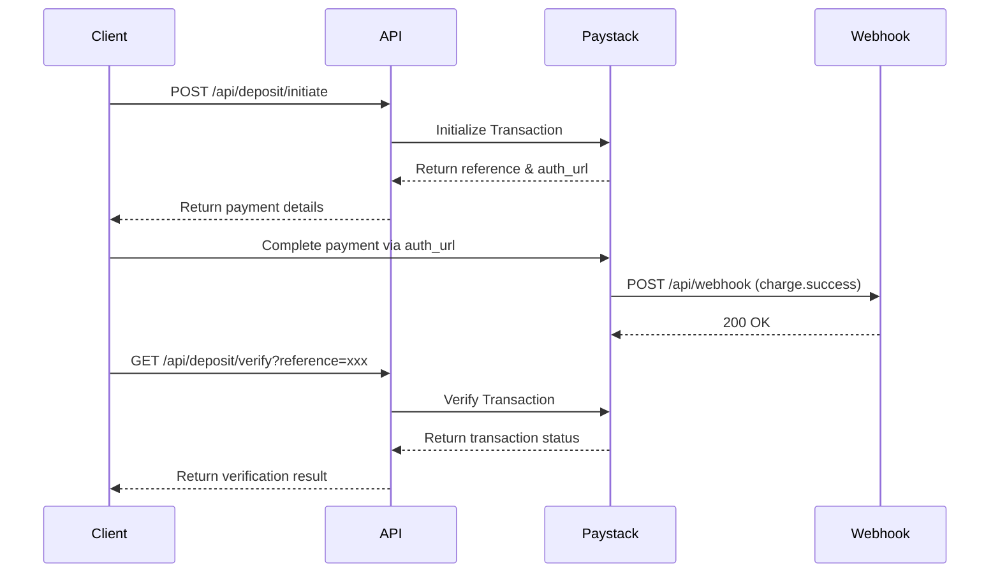

# Q-Payment API

A robust payment API built with Paystack integration for handling deposits and payment webhooks.

## Table of Contents

- [Overview](#overview)
- [Authentication](#authentication)
- [Base URL](#base-url)
- [Environment Variables](#environment-variables)
- [API Endpoints](#api-endpoints)
  - [Deposit - Initiate](#deposit---initiate)
  - [Deposit - Verify](#deposit---verify)
  - [Webhook](#webhook)
- [Error Handling](#error-handling)

---

## Overview

Q-Payment API provides a secure backend for processing deposits via Paystack's bank transfer channel. It includes endpoints for initiating deposits, verifying transaction statuses, and receiving real-time payment notifications via webhooks.

---

## Authentication

### API Key Authentication

All deposit endpoints require an API key passed via the `x-api-key` header.

```
x-api-key: your-api-key-here
```

> **Note:** The webhook endpoint does **not** use API key authentication. Instead, it validates incoming requests using Paystack's signature verification mechanism.

---

## Base URL

```
https://q-payment-api.vercel.app
```

---

## Environment Variables

| Variable              | Description                          | Required |
|-----------------------|--------------------------------------|----------|
| `PAYSTACK_SECRET_KEY` | Your Paystack secret key             | ✅        |
| `QUORIX_API_KEY`      | API key for authenticating requests  | ✅        |

---

## API Endpoints

### Deposit - Initiate

Initializes a new deposit transaction via Paystack bank transfer.

**Endpoint:**
```
POST /api/deposit/initiate
```

**Headers:**

| Header        | Type     | Required | Description              |
|---------------|----------|----------|--------------------------|
| `Content-Type`| `string` | ✅        | `application/json`       |
| `x-api-key`   | `string` | ✅        | Your API key             |

**Request Body:**

| Field   | Type     | Required | Description                              |
|---------|----------|----------|------------------------------------------|
| `email` | `string` | ✅        | Customer's email address                 |
| `amount`| `number` | ✅        | Amount to deposit (in main currency unit)|

**Example Request:**

```bash
curl -X POST https://your-api-url.vercel.app/api/deposit/initiate \
  -H "Content-Type: application/json" \
  -H "x-api-key: your-api-key" \
  -d '{
    "email": "customer@example.com",
    "amount": 5000
  }'
```

**Success Response (200 OK):**

```json
{
  "status": "pending",
  "reference": "abc123xyz",
  "authorization_url": "https://checkout.paystack.com/abc123xyz",
  "access_code": "abc123xyz"
}
```

| Field               | Type     | Description                                    |
|---------------------|----------|------------------------------------------------|
| `status`            | `string` | Transaction status (`pending`)                 |
| `reference`         | `string` | Unique transaction reference                   |
| `authorization_url` | `string` | URL to complete the payment                    |
| `access_code`       | `string` | Access code for the transaction                |

**Error Responses:**

| Status | Description                          | Response                                           |
|--------|--------------------------------------|----------------------------------------------------|
| `400`  | Missing required fields              | `{ "error": "Email and amount are required" }`     |
| `401`  | Invalid or missing API key           | `{ "error": "Unauthorized: Invalid or missing API key" }` |
| `405`  | Method not allowed                   | `{ "error": "Method not allowed" }`                |
| `500`  | Server error                         | `{ "error": "Error initializing deposit" }`        |

---

### Deposit - Verify

Verifies the status of a deposit transaction using its reference.

**Endpoint:**
```
GET /api/deposit/verify
```

**Headers:**

| Header        | Type     | Required | Description              |
|---------------|----------|----------|--------------------------|
| `x-api-key`   | `string` | ✅        | Your API key             |

**Query Parameters:**

| Parameter   | Type     | Required | Description                        |
|-------------|----------|----------|------------------------------------|
| `reference` | `string` | ✅        | Transaction reference from initiate|

**Example Request:**

```bash
curl -X GET "https://your-api-url.vercel.app/api/deposit/verify?reference=abc123xyz" \
  -H "x-api-key: your-api-key"
```

**Success Response (200 OK) - Transaction Successful:**

```json
{
  "status": "success",
  "message": "Deposit verified successfully",
  "amount": 5000,
  "customer": {
    "id": 12345,
    "email": "customer@example.com",
    "customer_code": "CUS_abc123"
  },
  "channel": "bank_transfer",
  "paid_at": "2024-12-31T10:30:00.000Z"
}
```

| Field      | Type     | Description                              |
|------------|----------|------------------------------------------|
| `status`   | `string` | Transaction status (`success`)           |
| `message`  | `string` | Verification message                     |
| `amount`   | `number` | Amount deposited (in main currency unit) |
| `customer` | `object` | Customer details from Paystack           |
| `channel`  | `string` | Payment channel used                     |
| `paid_at`  | `string` | ISO 8601 timestamp of payment            |

**Success Response (200 OK) - Transaction Pending/Failed/Abandoned:**

```json
{
  "status": "pending",
  "message": "Transaction is pending"
}
```

| Status Value | Description                                      |
|--------------|--------------------------------------------------|
| `pending`    | Transaction is awaiting payment                  |
| `failed`     | Transaction failed                               |
| `abandoned`  | Transaction was abandoned by user                |

**Error Responses:**

| Status | Description                          | Response                                           |
|--------|--------------------------------------|----------------------------------------------------|
| `400`  | Missing reference                    | `{ "error": "Transaction reference is required" }` |
| `401`  | Invalid or missing API key           | `{ "error": "Unauthorized: Invalid or missing API key" }` |
| `405`  | Method not allowed                   | `{ "error": "Method not allowed" }`                |
| `500`  | Server error                         | `{ "error": "Error verifying deposit" }`           |

---

### Webhook

Receives real-time payment notifications from Paystack. This endpoint should be configured in your Paystack dashboard.

**Endpoint:**
```
POST /api/webhook
```

**Headers:**

| Header                  | Type     | Required | Description                           |
|-------------------------|----------|----------|---------------------------------------|
| `Content-Type`          | `string` | ✅        | `application/json`                    |
| `x-paystack-signature`  | `string` | ✅        | HMAC SHA512 signature from Paystack   |

**Security:**

The webhook validates incoming requests using HMAC SHA512 signature verification:

1. Paystack signs the request body with your secret key
2. The signature is sent in the `x-paystack-signature` header
3. The API computes its own hash and compares it to the provided signature
4. Requests with invalid signatures are rejected with `401 Unauthorized`

**Webhook Events Handled:**

| Event           | Description                              |
|-----------------|------------------------------------------|
| `charge.success`| Payment was successful                   |

**Example Payload (charge.success):**

```json
{
  "event": "charge.success",
  "data": {
    "reference": "abc123xyz",
    "amount": 500000,
    "customer": {
      "id": 12345,
      "email": "customer@example.com",
      "customer_code": "CUS_abc123"
    },
    "channel": "bank_transfer",
    "paid_at": "2024-12-31T10:30:00.000Z"
  }
}
```

> **Note:** The `amount` field in webhook payloads is in **kobo** (1/100 of the main currency unit). The API converts this internally.

**Success Response (200 OK):**

```json
{
  "status": "success"
}
```

**Error Responses:**

| Status | Description                       | Response                                           |
|--------|-----------------------------------|----------------------------------------------------|
| `400`  | No request body provided          | `{ "error": "No request body provided" }`          |
| `401`  | Invalid signature                 | `{ "error": "Invalid signature" }`                 |
| `405`  | Method not allowed                | `{ "error": "Method not allowed" }`                |
| `500`  | Server configuration/processing error | `{ "error": "Webhook processing failed" }`     |

**Setting Up Webhook in Paystack:**

1. Log in to your [Paystack Dashboard](https://dashboard.paystack.com)
2. Navigate to **Settings** → **API Keys & Webhooks**
3. Enter your webhook URL: `https://your-api-url.vercel.app/api/webhook`
4. Save the configuration

---

## Error Handling

All API errors follow a consistent format:

```json
{
  "error": "Error message describing the issue"
}
```

### HTTP Status Codes

| Code  | Description                                      |
|-------|--------------------------------------------------|
| `200` | Success                                          |
| `400` | Bad Request - Missing or invalid parameters      |
| `401` | Unauthorized - Invalid API key or signature      |
| `405` | Method Not Allowed - Wrong HTTP method used      |
| `500` | Internal Server Error - Server-side issue        |

---

## Usage Flow

### Typical Deposit Flow



### Steps:

1. **Initiate**: Call `/api/deposit/initiate` with email and amount
2. **Redirect**: Send user to the `authorization_url` to complete payment
3. **Webhook**: Paystack sends a webhook when payment is complete
4. **Verify**: Call `/api/deposit/verify` to confirm the transaction status

---

## License

ISC
